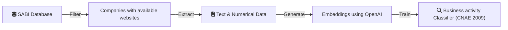
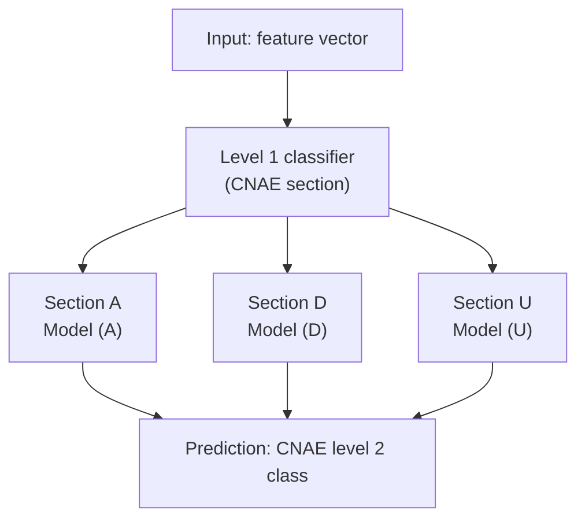

## __Business activity classification (CNAE) of Spanish companies by its web page.__

### Overview
This project addresses the challenge of classifying Spanish companies according to their economic activity using content extracted directly from their official websites. The classification follows the CNAE 2009 system, the national standard for economic activity codification in Spain.

Manual or self-declared categorization methods are often slow, inconsistent, and costly. In contrast, this project proposes a scalable, automated methodology that leverages natural language processing (NLP) and machine learning (ML) techniques to assign CNAE codes to companies based on the semantic content of their websites.



### Data Collection
The dataset of companies is extracted from the SABI (Sistema de Análisis de Balances Ibéricos) database, which contains financial and descriptive information on companies operating in Spain and Portugal. Initially, the dataset includes around 300,000 companies, those that have a website registered. Then this companies are filtered to retain only those with an available official website. After this filtering process, the dataset is reduced to approximately 150,000 companies.

### Feature Extraction
Once the list of companies is finalized, the content of each website is processed to extract only relevant textual and numerical information, removing unnecessary elements such as HTML tags, scripts, and styles. The cleaned text data is then transformed into vector representations using OpenAI's text embedding models. These embeddings serve as the input for the classification model.

### Model Architecture
The classification system follows a hierarchical approach aligned with the CNAE structure. 

This two-level model architecture is designed to mirror the structure of the CNAE system, allowing for more granular and accurate classification. It consists of:

* Section-level classifier: First, the system assigns one of the high-level CNAE sections. This classifier operates on the embedding representation of the company's web content.
* Division-level classifiers: Depending on the predicted section, the corresponding specialized model classifies the company into one of the finer-grained CNAE divisions (up to 88 total).

---

### How to Run the Project

To reproduce or extend the analysis, follow these steps. All necessary parameters are defined in the `config/parameters.yaml` file.

#### Prerequisites

* Python 3.10+
* `pip install -r requirements.txt`

#### Scripts

```bash
# Step 1: Data collection from SABI and company website matching
python src/scripts/run_data.py

# Step 2: Feature extraction (web scraping + embedding generation)
python src/scripts/run_features.py

# Step 3: Train and save the best-performing classification model
python src/scripts/run_model_train.py
```

### Repository Structure

```
web-cnae-classification/
├── config/
│   └── parameters.yaml  # Configuration file
├── src/
│   ├── scripts/
│   │   ├── run_data.py
│   │   ├── run_features.py
│   │   └── run_model_train.py
│   └── ... (helpers, models, etc.)
├── notebooks/
│   ├── eda.ipynb
│   └── traditional-models.ipynb
└── README.md
```