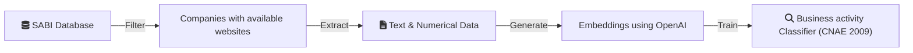

## __Business activity classification (CNAE) of Spanish companies by its web page.__

### Overview
This project aims to classify the business activity of Spanish companies based on the content of their official websites. The classification is based on the CNAE 2009 code system, which is the standard in Spain.

### Data Collection
The dataset of companies is extracted from the SABI (Sistema de Análisis de Balances Ibéricos) database, which contains financial and descriptive information on companies operating in Spain and Portugal. Initially, the dataset includes around 300,000 companies, which are filtered to retain only those with an available official website. After this filtering process, the dataset is reduced to approximately 150,000 companies.

### Data Processing
Once the list of companies is finalized, the content of each website is processed to extract only relevant textual and numerical information, removing unnecessary elements such as HTML tags, scripts, and styles.

### Feature Extraction
The cleaned text data is then transformed into vector representations using OpenAI's text embedding models. These embeddings serve as the input for the classification model.
